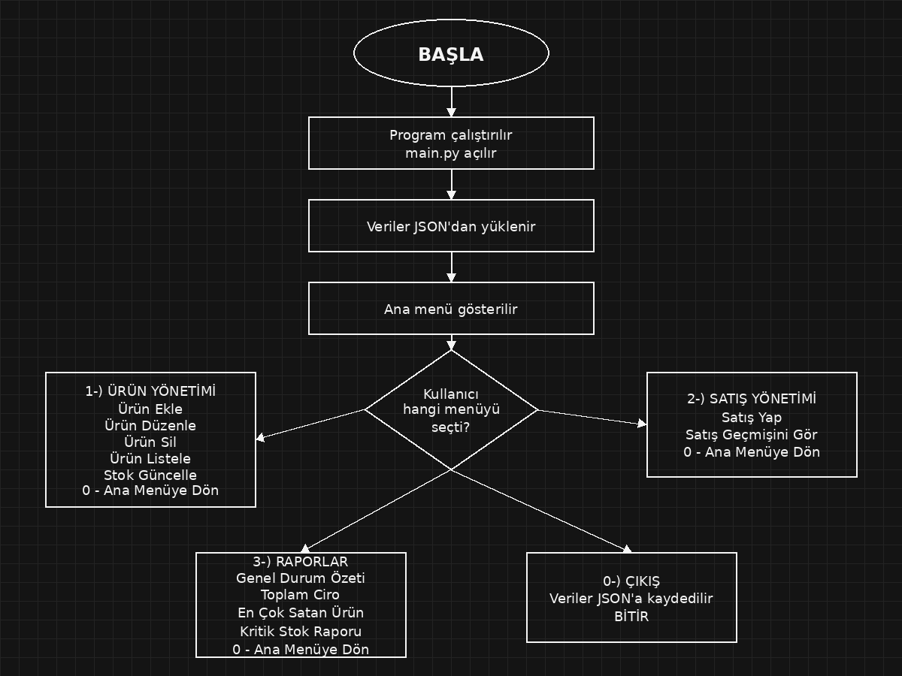

# Mağaza Satış ve Stok Takip Sistemi

Bu proje İleri Programlama dersi final projesi için hazırlanmıştır. Program konsol üzerinden çalışan basit bir mağaza satış ve stok takip sistemidir.

## Proje Ne İşe Yarıyor?

Bu program küçük bir mağazadaki ürünleri, stokları ve satışları takip etmek için yapılmıştır.

Program ile şunlar yapılabilir:

- Yeni ürün eklenebilir.
- Ürünler listelenebilir.
- Ürün bilgileri güncellenebilir.
- Ürün silinebilir.
- Kategoriye göre ürünler görüntülenebilir.
- Stok miktarı güncellenebilir.
- Satış yapılabilir.
- Satıştan sonra ürün stoğu otomatik azalır.
- Satış geçmişi görüntülenebilir.
- Toplam ciro görülebilir.
- En çok satan ürün görülebilir.
- Stoğu azalan ürünler kritik stok raporunda gösterilir.

## Program Nasıl Çalışıyor?

Program ilk açıldığında daha önce kaydedilen verileri `veriler.json` dosyasından yükler.

Daha sonra kullanıcıya ana menü gösterilir:

```text
1- Ürün Yönetimi
2- Satış Yönetimi
3- Raporlar
0- Çıkış
```

Kullanıcı bu menüden yapmak istediği işlemi seçer.

Çıkış yapılırken ürünler ve satışlar tekrar `veriler.json` dosyasına kaydedilir. Böylece program kapansa bile veriler kaybolmaz.

## Kullanılan Teknolojiler

- Python
- Nesne yönelimli programlama
- JSON dosya işlemleri
- datetime kütüphanesi
- os kütüphanesi

## Dosya Yapısı

Projede 3 Python dosyası kullanılmıştır:

```text
main.py
urun.py
magaza_sistemi.py
```

Ek olarak veri dosyası, README ve akış şeması da proje klasöründe bulunmaktadır.

```text
veriler.json
README.md
.gitignore
akis_semasi.png
```

## Sınıflar

Projede 3 tane sınıf kullanılmıştır.

### Urun

Ürün bilgilerini tutar.

Tutulan bilgiler:

- urun_id
- urun_adi
- kategori
- marka
- fiyat
- stok

### Satis

Satış bilgilerini tutar.

Tutulan bilgiler:

- urun_id
- urun_adi
- adet
- birim_fiyat
- toplam_tutar
- tarih

### MagazaSistemi

Programın ana sınıfıdır. Ürün ekleme, satış yapma, rapor alma ve JSON kaydetme/yükleme işlemleri bu sınıfta yapılır.

## Kategoriler

Programda kullanılan ürün kategorileri:

- Ayakkabı
- Çanta
- Valiz
- Diğer

## Kritik Stok

Stok miktarı 3 veya daha az olan ürünler kritik stok olarak kabul edilir.

## Programı Çalıştırma

Bilgisayarda Python kurulu olmalıdır.

Proje klasöründe terminal veya PowerShell açılır.

Sonra şu komut çalıştırılır:

```bash
py main.py
```

Eğer bu komut çalışmazsa şu komut denenebilir:

```bash
python main.py
```

## Örnek Kullanım

Örnek olarak kullanıcı önce ürün ekleyebilir:

```text
Ürün Adı: Nike Air Max 092
Kategori: Ayakkabı
Marka: Nike
Fiyat: 4500
Stok: 5
```

Daha sonra satış yapılabilir:

```text
Ürün ID: 1
Satılacak adet: 2
```

Bu satıştan sonra ürünün stoğu 5'ten 3'e düşer ve satış geçmişine kayıt eklenir.

## Veri Kaydetme

Programda bilgiler `veriler.json` dosyasında saklanır.

Programdan çıkış yapılırken veriler otomatik olarak kaydedilir. Program tekrar açıldığında eski ürünler ve satışlar geri yüklenir.

## Akış Şeması

Projenin ana çalışma mantığını gösteren akış şeması proje klasöründe bulunmaktadır.



## Not

Bu proje çok karmaşık yapılmadan, ders şartnamesindeki maddeleri karşılayacak şekilde hazırlanmıştır. Amaç; ürün, stok ve satış takibini yapan çalışan bir Python uygulaması yapmaktır.
